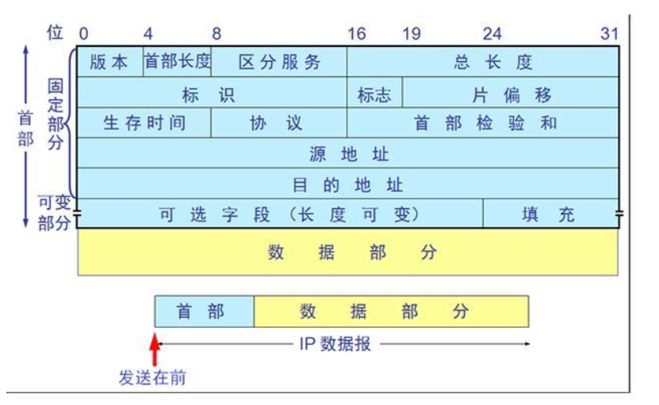

---

layout: post

title: TCP/IP网络协议

tag: 网络

---
# TCP/IP网络协议

## 1、什么是TCP /IP协议

​	TCP/IP协议（传输控制协议/互联网协议）不是简单的一个协议，而是一组特别的协议，包括：TCP，IP，UDP，ARP等，这些被称为子协议。在这些协议中，最重要、最著名的就是TCP和IP。因此，大部分网络管理员称整个协议族为“TCP/IP”。

## 2、重要概念

互联网地址：IP地址，一般为网络号+子网号+主机号域名系统：通俗的来说，就是一个数据库，可以将主机名转换成IP地址RFC：TCP/IP协议的标准文档端口号：一个逻辑号码，IP包所带有的标记Socket：应用编程接口数据链路层的工作特性：为IP模块发送和接收IP数据报为ARP模块发送ARP请求和接收ARP应答（ARP：地址解析协议，将IP地址转换成MAC地址）。

[^ARP]: 地址解析协议，即ARP（Address Resolution Protocol），是根据[IP地址](https://baike.baidu.com/item/IP地址)获取[物理地址](https://baike.baidu.com/item/物理地址/2129)的一个[TCP/IP协议](https://baike.baidu.com/item/TCP%2FIP协议)。[主机](https://baike.baidu.com/item/主机/455151)发送信息时将包含目标IP地址的ARP请求广播到网络上的所有主机，并接收返回消息，以此确定目标的物理地址；收到返回消息后将该IP地址和物理地址存入本机ARP缓存中并保留一定时间，下次请求时直接查询ARP缓存以节约资源。地址解析协议是建立在网络中各个主机互相信任的基础上的，网络上的主机可以自主发送ARP应答消息，其他主机收到应答报文时不会检测该报文的真实性就会将其记入本机ARP缓存；由此攻击者就可以向某一主机发送伪ARP应答报文，使其发送的信息无法到达预期的主机或到达错误的主机，这就构成了一个[ARP欺骗](https://baike.baidu.com/item/ARP欺骗)。[ARP命令](https://baike.baidu.com/item/ARP命令)可用于查询本机ARP缓存中IP地址和[MAC地址](https://baike.baidu.com/item/MAC地址)的对应关系、添加或删除静态对应关系等。相关协议有[RARP](https://baike.baidu.com/item/RARP)、[代理ARP](https://baike.baidu.com/item/代理ARP)。[NDP](https://baike.baidu.com/item/NDP)用于在[IPv6](https://baike.baidu.com/item/IPv6)中代替地址解析协议。
[^IMCP协议]: Internet控制[报文](https://baike.baidu.com/item/报文/3164352)协议。它是[TCP/IP协议簇](https://baike.baidu.com/item/TCP%2FIP协议簇)的一个子协议，用于在IP[主机](https://baike.baidu.com/item/主机/455151)、[路由](https://baike.baidu.com/item/路由)器之间传递控制消息。控制消息是指[网络通](https://baike.baidu.com/item/网络通)不通、[主机](https://baike.baidu.com/item/主机/455151)是否可达、[路由](https://baike.baidu.com/item/路由/363497)是否可用等网络本身的消息。这些控制消息虽然并不传输用户数据，但是对于用户数据的传递起着重要的作用。 [1] ICMP使用IP的基本支持，就像它是一个更高级别的协议，但是，ICMP实际上是IP的一个组成部分，必须由每个IP模块实现。
[^RIP协议]: 是一种[内部网关协议](https://baike.baidu.com/item/内部网关协议)（IGP），是一种[动态路由选择](https://baike.baidu.com/item/动态路由选择/1250467)协议，用于自治系统（AS）内的路由信息的传递。RIP协议基于距离矢量算法（DistanceVectorAlgorithms），使用“跳数”(即metric)来衡量到达目标地址的路由距离。这种协议的[路由器](https://baike.baidu.com/item/路由器/108294)只关心自己周围的[世界](https://baike.baidu.com/item/世界/24458)，只与自己相邻的路由器交换信息，范围限制在15跳(15度)之内，再远，它就不关心了。RIP应用于OSI网络七层模型的应用层。

TCP协议：

​		一种面向连接的、可靠的、基于字节流的传输层通信协议，由IETF的RFC 793 [1]  定义。TCP旨在适应支持多网络应用的分层协议层次结构。 连接到不同但互连的计算机通信网络的主计算机中的成对进程之间依靠TCP提供可靠的通信服务。TCP假设它可以从较低级别的协议获得简单的，可能不可靠的数据报服务。 原则上，TCP应该能够在从硬线连接到分组交换或电路交换网络的各种通信系统之上操作。

- 源端口号/目的端口号: 表示数据从哪个进程来, 到哪个进程去.
- 32位序号:
- 4位首部长度: 表示该tcp报头有多少个4字节(32个bit)
- 6位保留: 顾名思义, 先保留着, 以防万一
- 6位标志位
  - URG: 标识紧急指针是否有效 
    ACK: 标识确认序号是否有效 
    PSH: 用来提示接收端应用程序立刻将数据从tcp缓冲区读走 
    RST: 要求重新建立连接. 我们把含有RST标识的报文称为复位报文段 
    SYN: 请求建立连接. 我们把含有SYN标识的报文称为同步报文段 
- 16位窗口大小:
- 16位检验和: 由发送端填充, 检验形式有CRC校验等. 如果接收端校验不通过, 则认为数据有问题. 此处的校验和不光包含TCP首部, 也包含TCP数据部分.
- 16位紧急指针: 用来标识哪部分数据是紧急数据.
- 选项和数据暂时忽略

TCP的连接机制

​	tcp需要经过三次握手建立连接, 四次挥手断开连接.

**三次握手**

第一次: 
客户端 - - > 服务器 此时服务器知道了客户端要建立连接了 
第二次: 
客户端 < - - 服务器 此时客户端知道服务器收到连接请求了 
第三次: 
客户端 - - > 服务器 此时服务器知道客户端收到了自己的回应

四次挥手

1, 客户端进程发出连接释放报文，并且停止发送数据。 
释放数据报文首部，FIN=1，其序列号为seq=u（等于前面已经传送过来的数据的最后一个字节的序号加1），此时客户端进入FIN-WAIT-1（终止等待1）状态。 TCP规定，FIN报文段即使不携带数据，也要消耗一个序号。 
2, 服务器收到连接释放报文，发出确认报文，ACK=1，确认序号为 u+1，并且带上自己的序列号seq=v，此时服务端就进入了CLOSE-WAIT（关闭等待）状态。 
TCP服务器通知高层的应用进程，客户端向服务器的方向就释放了，这时候处于半关闭状态，即客户端已经没有数据要发送了，但是服务器若发送数据，客户端依然要接受。这个状态还要持续一段时间，也就是整个CLOSE-WAIT状态持续的时间。 
3, 客户端收到服务器的确认请求后，此时客户端就进入FIN-WAIT-2（终止等待2）状态，等待服务器发送连接释放报文（在这之前还需要接受服务器发送的最终数据） 
4, 服务器将最后的数据发送完毕后，就向客户端发送连接释放报文，FIN=1，确认序号为v+1，由于在半关闭状态，服务器很可能又发送了一些数据，假定此时的序列号为seq=w，此时，服务器就进入了LAST-ACK（最后确认）状态，等待客户端的确认。 
5, 客户端收到服务器的连接释放报文后，必须发出确认，ACK=1，确认序号为w+1，而自己的序列号是u+1，此时，客户端就进入了TIME-WAIT（时间等待）状态。注意此时TCP连接还没有释放，必须经过2∗MSL（最长报文段寿命）的时间后，当客户端撤销相应的TCB后，才进入CLOSED状态。 

6, 服务器只要收到了客户端发出的确认，立即进入CLOSED状态。同样，撤销TCB后，就结束了这次的TCP连接。可以看到，服务器结束TCP连接的时间要比客户端早一些。

